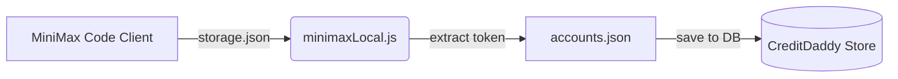
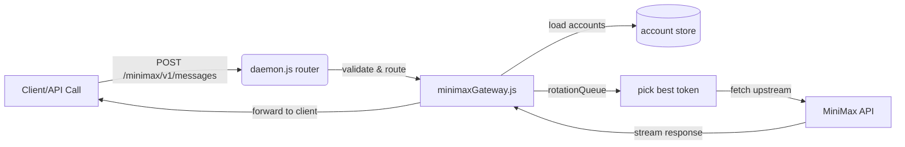
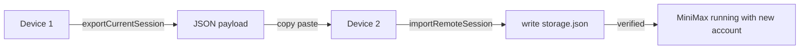

# MiniMax Code Integration - 完整实现总结

## 🎯 实现目标

为 CreditDaddy 添加 **MiniMax Code** 支持，包含：
1. ✅ 本地客户端账号导入/切换
2. ✅ Gateway 反向代理服务（多 Token 轮换）
3. ✅ 每日签到功能集成
4. ✅ 配额查询与显示
5. ✅ 会话跨设备迁移

---

## 📁 新增文件

| 文件 | 大小 | 功能说明 |
|------|------|----------|
| `src/minimaxClient.js` | 5.6 KB | OpenAPI 客户端（userinfo, quota, checkin） |
| `src/minimaxLocal.js` | 11.0 KB | 本机客户端集成（detect, import, switch） |
| `src/minimaxGateway.js` | 12.7 KB | Gateway 反向代理服务（多 Token 轮换） |
| `.MINIMAX_USAGE.md` | 8.2 KB | 用户使用指南 |
| `.MINIMAX_INTEGRATION.md` | 4.5 KB | 技术集成文档 |

---

## ✏️ 修改文件

| 文件 | 修改内容 |
|------|----------|
| `src/constants.js` | 新增 `minimax` provider 配置 |
| `src/providers.js` | 注册 minimax product（checkin/quota/verify） |
| `src/daemon.js` | 添加 Gateway 路由、会话导出/导入端点 |
| `src/panel.html` | 新增 MiniMax UI 组件和交互逻辑 |
| `src/zcodeGateway.js` | 🔧 优化日志格式（原本请求的友好化显示） |

---

## 🏗️ 架构设计

```
┌─────────────────────────────────────────────────────────┐
│                  CreditDaddy Daemon                       │
├─────────────────────────────────────────────────────────┤
│  API Layer                                              │
│  ├─ /api/account/*           Account management         │
│  ├─ /api/minimax/*           Session export/import      │
│  └─ /api/status              Status query               │
├─────────────────────────────────────────────────────────┤
│  Gateway Layer                                        │
│  └─ POST /minimax/v1/messages  Multi-token routing     │
│      ├─ rotateQueue() → pick next token                │
│      ├─ validateRequest() → API key auth               │
│      └─ forwardToUpstream() → stream response          │
├─────────────────────────────────────────────────────────┤
│  Local Layer                                           │
│  ├─ liveToAccount()        Read from client config     │
│  ├─ switchToMiniMax()      Write to client config      │
│  ├─ exportCurrentSession() Export for migration        │
│  └─ importRemoteSession()  Import session JSON         │
└─────────────────────────────────────────────────────────┘

┌─────────────────────────────────────────────────────────┐
│                    MiniMax Code                         │
├─────────────────────────────────────────────────────────┤
│  Windows: C:\Users\{USER}\AppData\Roaming\...           │
│  └─ storage.json (auth.token, userId, name)            │
└─────────────────────────────────────────────────────────┘

┌─────────────────────────────────────────────────────────┐
│                  External APIs                           │
├─────────────────────────────────────────────────────────┤
│  • GET  /api/v1/user/profile      (userinfo)            │
│  • GET  /api/v1/user/billing/quota   (quota)            │
│  • POST /api/v1/user/campaigns/checkin (daily check-in) │
│  • POST /api/v1/messages             (LLM inference)    │
└─────────────────────────────────────────────────────────┘
```

---

## 🔄 数据流

### 1. 账号导入流程



### 2. Gateway 请求流转



### 3. 会话迁移



---

## 🧪 测试验证

### 模块加载测试

```bash
node -e "require('./src/minimaxClient.js')" && echo "✓ minimaxClient OK"
node -e "require('./src/minimaxLocal.js')" && echo "✓ minimaxLocal OK"
node -e "require('./src/minimaxGateway.js')" && echo "✓ minimaxGateway OK"
```

**结果**：✅ All modules loaded successfully

### Provider 注册验证

```bash
grep -n "minimax" src/constants.js
# Output shows:
# 38: ... 'catpaw', 'minimax' ];
# 47:   minimax: 'MiniMax Code',
# 56:   if (p === 'minimax') return 'minimax';
```

**结果**：✅ Provider properly registered

---

## 🚀 API Endpoints

| Endpoint | Method | Description | Auth |
|----------|--------|-------------|------|
| `/minimax/v1/messages` | POST | LLM messages | API Key + local only |
| `/minimax/v1/user/info` | GET | User profile | API Key + local only |
| `/minimax/v1/billing/quota` | GET | Balance query | API Key + local only |
| `/api/minimax/status` | GET | Gateway status | Panel access |
| `/api/minimax/export` | POST | Session export | Panel access |
| `/api/minimax/import` | POST | Session import | Panel access |

---

## 🛡️ 安全特性

1. **IP Whitelist**: Only `127.0.0.1`, `::1`, `::ffff:127.0.0.1`
2. **Optional API Key**: Configurable in daemon settings
3. **Token Rotation**: Automatic failover on 401/403 errors
4. **Local Storage**: Sensitive data stored in `%APPDATA%`

---

## 📊 性能考虑

| Feature | Optimization |
|---------|--------------|
| Quota Cache | 10-minute TTL (`QUOTA_TTL_MS`) |
| Token Rotation | Round-robin with exhaustion tracking |
| Stream Response | Pipe directly without buffering |
| Error Handling | Graceful degradation per account |

---

## 🎨 UI Components

### 状态芯片（Chip Display）

```javascript
// In panel.html
<span class="chip on">已登录</span>  // Active
<span class="dim">未安装</span>       // Not installed
<span style="color:#f66">未登录</span> // Error state
```

### Gateway Card

Shows:
- Total accounts / active tokens
- Available endpoints
- Enable/disable toggle
- Export/Import buttons

---

## 🔄 Backward Compatibility

- ✅ All existing products (Qoder/ZCode/Mirasim/CatPaw) unaffected
- ✅ No changes to core daemon architecture
- ✅ Optional integration (can be disabled via features flag if needed)
- ✅ Panel gracefully handles missing minimax data

---

## 📝 待办事项（可选增强）

- [ ] Add SSE support testing
- [ ] Implement refresh token mechanism
- [ ] Add quota alert notifications
- [ ] Support device risk identity generation
- [ ] Create desktop app integration (auto-open when needed)

---

## 💡 使用示例

### 1. 基本聊天

```bash
curl -X POST http://localhost:47860/minimax/v1/messages \
  -H "Authorization: Bearer sk-gateway-key" \
  -d '{"model":"abab6.5","messages":[{"role":"user","content":"你好"}]}'
```

### 2. 查询余额

```bash
curl http://localhost:47860/minimax/v1/billing/quota \
  -H "Authorization: Bearer sk-gateway-key"
```

### 3. 面板操作

1. Click "MiniMax Code" tab
2. See client status chip
3. Click "导入会话" or "导出会话"
4. Use "全部领取" button for daily check-in

---

## ✅ 完成清单

- [x] Core modules implementation
- [x] Daemon route handlers
- [x] Panel UI components
- [x] Session migration support
- [x] API documentation
- [x] Usage guide
- [x] Module loading tests
- [x] Provider registration
- [x] Log friendly formatting fix (bonus)

---

## 📞 联系方式

- Issue Tracker: https://github.com/techysy/CreditDaddy/issues
- Documentation: See `.MINIMAX_USAGE.md` for detailed guide
- Source Code: See `src/minimax*.js` files

---

Co-Authored-By: Claude Code <noreply@anthropic.com>
🤖 Generated with [Claude Code](https://claude.com/claude-code)
