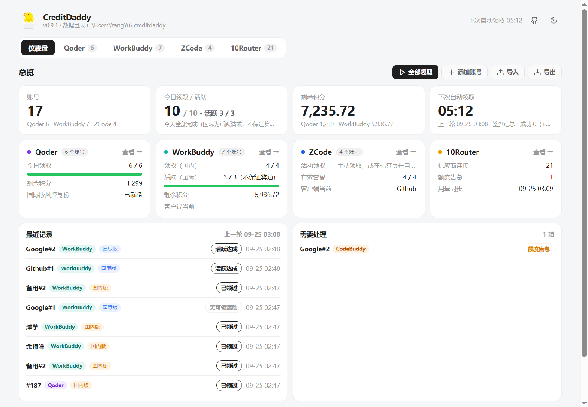
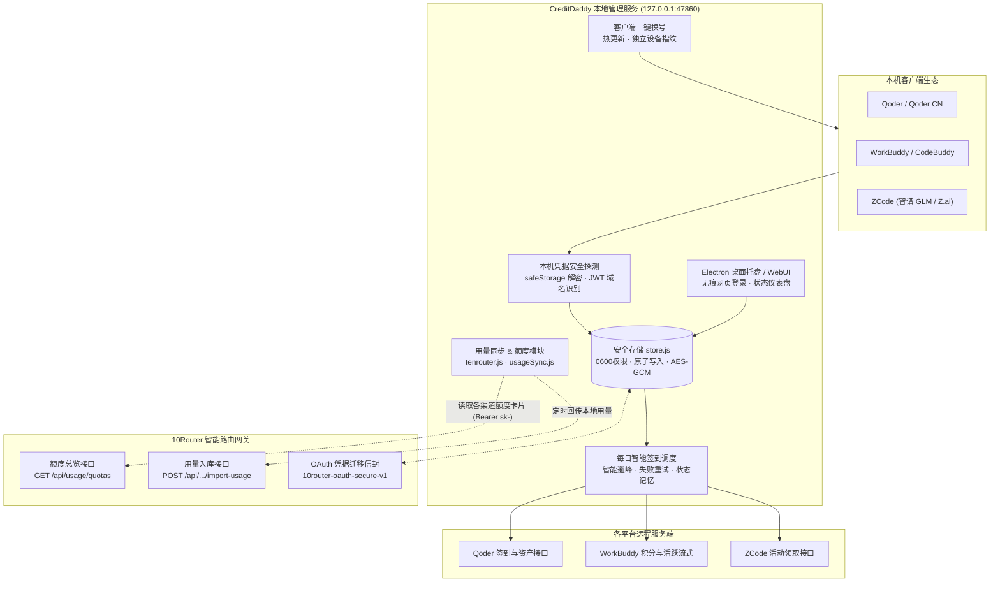

<div align="center">


# CreditDaddy

**AI 编程工具多账号本地管理 + 每日积分自动领取（领鸡蛋）助手：Qoder · WorkBuddy · ZCode，集成 10Router 额度总览与用量同步**

[](https://github.com/techysy/CreditDaddy/releases/latest)
[](https://github.com/techysy/CreditDaddy/actions/workflows/ci.yml)
[](https://github.com/techysy/CreditDaddy/releases)
[](https://www.npmjs.com/package/creditdaddy)
[](#下载)
[](https://nodejs.org/)
[](LICENSE)

[下载](#下载) · [架构](#%EF%B8%8F-架构) · [功能](#功能) · [10Router 集成](#10router-集成) · [产品线说明](#产品线说明) · [快速开始](#快速开始) · [HTTP API](#本地-http-api) · [相关项目](#-相关项目) · [许可证](#-许可证)



</div>

> 项目原名 **QoderDaddy**，v0.3.0 起更名为 CreditDaddy：数据目录自动从 `~/.qoderdaddy` 迁移到 `~/.creditdaddy`（旧目录保留），旧的 `QODERDADDY_HOME` / `QODERDADDY_PASSWORD` 环境变量与 QoderDaddy 导出文件仍可使用。
> 架构参考 [WorkDaddy](https://github.com/babygoton/WorkDaddy)（本地守护进程 + Web 面板 + 数据全留本机 + 仅监听 127.0.0.1），签到能力移植自 [10router](https://github.com/techysy/10router) 的 qoderCheckin / codebuddyCheckin，并按 Qoder App 0.2.x、WorkBuddy 桌面端的真实协议补全。

## 下载

从 [**Releases**](https://github.com/techysy/CreditDaddy/releases/latest) 下载对应平台的安装包：

| 平台 | 文件 | 说明 |
| --- | --- | --- |
| Windows | `CreditDaddy-Setup-<版本>.exe` | 安装版（推荐） |
| Windows | `CreditDaddy-Portable-<版本>.exe` | 便携版，免安装，双击运行 |
| macOS（Apple Silicon） | `mac-CreditDaddy-<版本>-arm64.dmg` | M1 及以后的芯片 |
| macOS（Intel） | `mac-CreditDaddy-<版本>.dmg` | Intel 芯片 |
| 飞牛 fnOS | `creditdaddy-window-<版本>-x86.fpk` | **推荐**：桌面窗口入口（x86） |
| 飞牛 fnOS | `creditdaddy-window-<版本>-arm.fpk` | 桌面窗口入口（ARM） |
| 飞牛 fnOS | `creditdaddy-<版本>-x86.fpk` | 独立全屏 / 兼容入口（x86） |
| 飞牛 fnOS | `creditdaddy-<版本>-arm.fpk` | 独立全屏 / 兼容入口（ARM） |

> macOS 安装包未做代码签名：首次打开请在「应用程序」里**右键 → 打开**，或在终端执行 `xattr -cr /Applications/CreditDaddy.app`。
> 飞牛 fnOS 部署自动启用密码保护，首次安装在向导中设置密码，「应用设置」中可重置。

---

## 🏗️ 架构



---

## 功能

**多账号管理与切换**
- **仪表盘 + 分产品标签页**：首页仪表盘汇总账号总数、今日领取进度、剩余总积分、下次自动执行时间、各产品概况、待处理异常账号（token 失效 / 即将过期、领取失败）与最近领取审计；Qoder、WorkBuddy、ZCode 各自独立标签页，卡片式展示，支持国内 / 国际版筛选，直观查看连续天数与额度包到期，自适应亮色 / 暗色主题。
- **本机导入**：一键安全读取本机已登录的客户端凭据 —— 本地解密 Qoder / Qoder CN 的 `auth.v1.dat`，读取 WorkBuddy 客户端（当前与历史会话），解密 ZCode 凭据。敏感 Token 绝不出机器；同一用户续期时自动覆盖。
- **客户端一键换号**：一键将桌面客户端切换至指定账号（WorkBuddy 自动热切换；ZCode 退出客户端后写回），切号前自动保存当前在线 Token，各账号拥有独立设备指纹，杜绝风控串号。
- **内置隐私（无痕）授权**：桌面版提供隔离的一次性会话窗口进行网页登录授权，不污染系统浏览器 Cookie，支持同平台无缝扩增多账号。
- **全流程浏览器登录**：支持三家产品线在面板内直接完成网页 / 设备码授权并入库 —— Qoder 设备码授权（PKCE + nonce）、WorkBuddy 状态轮询、ZCode CLI 轮询（支持智谱 BigModel 与 Z.ai）。

**自动领取与资产保障**
- **每日智能轮询**：本地守护进程每 ~2 小时自动扫描执行；当日已领成功的账号自动记忆跳过，未开启活动的账号不落记忆，以每日 10:00 (UTC+8) 刷新周期为准自动重试。
- **Qoder 国际版风控支持**：真实携带客户端生成的设备风控凭据，还原官方客户端「每日 100 Credits」领取链路。
- **ZCode 活动智能轮询**：支持免验证码活动直领，遇到图形验证码时桌面版自动拉起静默验证（高风险弹出人工窗口处理），NAS / CLI 环境自动标记提示。
- **凭据导出导入**：支持口令加密备份，格式与 10Router OAuth 迁移标准（`10router-oauth-secure-v1`）无缝互通，实现多端授权轻松迁移。
- **安全边界**：守护进程仅监听 `127.0.0.1` 本机回环，严格校验 Host 头防止 DNS 重绑定，拦截跨站 Origin 杜绝 CSRF；存储位于 `~/.creditdaddy`（0600 权限 + 原子写 + 串行锁），无遥测、无第三方依赖。

## 10Router 集成

在面板「10Router」标签页配置 10Router 服务地址与仪表盘创建的 **虚拟 key**（sk-…）。Key 仅存储于本地 `tenrouter.json`（0600 权限），面板只显示脱敏值。

- **供应商额度卡片（10Router 1.2.1+）**：通过 `GET /api/usage/quotas` 一键读取 10Router 中其他供应商（CodeBuddy / Qoder / Claude / GLM 等）的额度卡片。CodeBuddy / Qoder / GLM 会自动标明**国内版 / 国际版**，当额度不足 10% 时自动标红并推送到仪表盘「需要处理」。支持 5 分钟连接级缓存与手动强制刷新。
- **用量自动同步（10Router 1.0.7+）**：内置与 10router-sync 插件一致的同步逻辑，支持一键或每小时自动同步本机 ZCode（`db.sqlite` 官方渠道）、OpenCode（`opencode.db`）、mirasim（`usage-*.ndjson`）、小米 MiMo（`mimocode.db`）的真实用量至 10Router 统计。支持断点续传与 2 天重叠补偿，服务端校验签名去重。
- *注：读取 SQLite 依赖 Node 22.5+ 内置的 `node:sqlite`（桌面版与 fnOS nodejs_v24 环境原生支持）。*

## 产品线说明

### WorkBuddy（腾讯 CodeBuddy 系）
- **账号来源**：共享 CodeBuddy CLI / 插件凭据目录 `%LOCALAPPDATA%\CodeBuddyExtension\Data\Public\auth\`（macOS `~/Library/Application Support/CodeBuddyExtension/…`，Linux `~/.local/share/CodeBuddyExtension/…`）。按 Keycloak JWT 签发域名自动区分：`*.codebuddy.cn` / `*.workbuddy.cn` / `copilot.tencent.com` 识别为国内版，`*.codebuddy.ai` / `*.workbuddy.ai` 识别为国际版。
- **签到与积分**：国内版调用 `/v2/billing/meter/daily-checkin` 领取积分并累计签到天数；调用 `/v2/billing/meter/get-user-resource` 查询循环额度与活动赠送包剩余量。
- **国际版保持活跃**：国际版官方无签到接口，规则为「每日有效对话即可获取赠送积分」。调度器每日自动为国际版账号发起一次极简免费档模型流式会话（rateMultiplier 0，几乎零消耗），达成活跃条件。
- **Token 续期与切号**：过期时自动通过 refreshToken 换发新 Token。若为客户端当前登录账号，会同步写回文件避免客户端掉线；切号时安全写入 `workbuddy-desktop.info` 并触发客户端热切换。

### ZCode（智谱 GLM / Z.ai）
- **账号来源**：读取 `~/.zcode/v2/credentials.json`，本地通过派生密钥解密 `enc:v1:` AES-256-GCM 凭据，Token 绝不出机。
- **活动领取**：支持自动轮询可领活动（`billing/preview` → `billing/claim`）。支持免验证码直接领取，需验证码时桌面端通过隐藏窗口调度验证码 SDK。
- **网络出口与客户端跟随**：接口校验客户端版本（注册表动态读取）。网络层支持配置专属代理（`zcode-net.json` 或 `HTTPS_PROXY`），支持「直连优先 / 代理优先」无缝切换。
- **账号切换**：写回凭据并自动为各账号分配独立的 `deviceMid` 设备指纹，防止多账号设备关联风控。

### Qoder（国际版 / 国内版）
- **国际版领取与设备风控**：Qoder 国际版服务端严格校验设备风控身份（`Cosy-MachineToken / Cosy-MachineCode / Cosy-MachineType`）。
- **设备组件依赖**：风控凭据由本机已安装的 Qoder 客户端组件生成（每 50 分钟刷新）。每台设备每日限领一个国际版账号，列表靠前账号优先领取。
- **Linux / fnOS 设备组件安装**：无客户端环境下，面板提供一键安装「设备身份组件」（或执行 `creditdaddy umid install`），自动从官方 `@qoder-ai/qodercli` 中提取 Linux x64 / arm64 UMID 核心组件。国内版不受风控限制，全部账号可正常签到。

## 快速开始

### 方式一：桌面安装版 / 便携版（推荐）

从 [Releases](https://github.com/techysy/CreditDaddy/releases/latest) 下载 Windows 或 macOS 版本：
- 桌面托盘常驻，关闭窗口后台持续运行。
- 托盘图标右键支持一键立即签到、查看各平台账号状态并弹窗通知结果。
- 开机自启后完全免干预在后台执行。

### 方式二：飞牛 fnOS 应用包（fpk）

1. 下载对应架构的 fpk 文件（推荐 `creditdaddy-window-<版本>-<架构>.fpk`）。
2. 在 fnOS 应用中心选择「手动安装」，安装过程中设置访问密码。
3. 安装完成后通过桌面的窗口图标即可进入管理面板。

### 方式三：Node.js CLI / 守护进程

要求 **Node.js ≥ 20**（纯标准库实现，零外部 npm 运行时依赖）：

```bash
# 全局安装（npm）
npm i -g creditdaddy

# 启动后台守护进程（默认访问 http://127.0.0.1:47860）
creditdaddy daemon
```

**CLI 常用命令**：

```bash
creditdaddy scan                    # 扫描导入本机 Qoder / WorkBuddy / ZCode 客户端登录的账号
creditdaddy add <token>             # 添加 Qoder 国际版账号
creditdaddy add <token> --cn        # 添加 Qoder 国内版账号
creditdaddy add <token> --workbuddy # 添加 WorkBuddy 国内版账号（--intl 为国际版）
creditdaddy add <token> --name 备注 # 添加带别名的账号
creditdaddy list                    # 列出当前所有账号状态与积分
creditdaddy checkin                 # 立即触发全部账号自动领取
creditdaddy checkin --cn            # 仅签到 Qoder 国内版（--intl 仅国际版）
creditdaddy checkin --workbuddy     # 仅签到 WorkBuddy
creditdaddy remove <id前缀>         # 删除指定账号
creditdaddy export backup.json --password 密码   # 安全加密导出账号
creditdaddy import backup.json [--password 密码] # 导入备份数据（兼容 10Router）
creditdaddy umid install            # Linux / fnOS 安装 Qoder 国际版设备身份组件
creditdaddy help                    # 查看完整命令行帮助
```

## 本地 HTTP API

守护进程提供丰富的控制端点。若设置了 `CREDITDADDY_PASSWORD` 环境变量（fnOS 默认设置），所有请求须携带 `x-qd-key: <密码>` 头：

| 方法 | 路径 | 说明 |
|---|---|---|
| `GET` | `/api/accounts` | 获取所有已托管账号的脱敏列表 |
| `POST` | `/api/accounts` | 添加新账号 `{name, provider, token}` |
| `PATCH` | `/api/accounts/:id` | 修改账号备注名称 `{name}` |
| `DELETE` | `/api/accounts/:id` | 删除指定账号 |
| `POST` | `/api/accounts/:id/checkin` | 单独触发指定账号的领取 |
| `GET` | `/api/accounts/:id/quota` | 查询指定账号的积分与额度明细 |
| `POST` | `/api/accounts/:id/switch` | 一键将客户端登录会话切换至该账号 |
| `GET` | `/api/accounts/:id/zcode/plans` | 查询 ZCode 账号的可用活动列表 |
| `POST` | `/api/accounts/:id/zcode/claim` | 领取指定的 ZCode 活动 `{planId, captchaParam?, region?}` |
| `GET` | `/api/zcode/captcha-config` | 获取 ZCode 图形验证码配置参数 |
| `POST` | `/api/checkin` | 触发全局领取 `{provider?, product?, skipIfCheckedToday?}` |
| `POST` | `/api/auth/device/start` | 发起浏览器登录授权会话 |
| `POST` | `/api/auth/device/poll` | 轮询浏览器登录状态与 Token `{sessionId}` |
| `GET` | `/api/local/detect` | 检测本机客户端与配置目录环境 |
| `POST` | `/api/local/scan` | 读取本机已登录的全部账号候选 |
| `POST` | `/api/local/import` | 批量将检测到的候选账号导入入库 |
| `GET` | `/api/status` | 获取服务运行状态、版本号及风控组件状态 |
| `GET` / `PUT` | `/api/tenrouter` | 查询 / 配置 10Router 集成参数 `{endpoint, key?, syncEnabled?, sources?}` |
| `POST` | `/api/tenrouter/test` | 测试 10Router 连通性与 Key 有效性 |
| `GET` | `/api/tenrouter/quotas` | 获取 10Router 聚合的外部供应商配额总览 |
| `GET` | `/api/tenrouter/health` | 检查 10Router 服务端自身健康状态 |
| `POST` | `/api/tenrouter/sync` | 立即触发本机模型用量向 10Router 同步 |
| `GET` / `POST` | `/api/qoder/umid` | 获取 / 一键安装 Linux 平台 Qoder 设备身份组件 |
| `GET` | `/api/logs` | 查看环形内存日志 |
| `POST` | `/api/export` / `/api/import` | 账号数据安全加密导出与导入 |

## 状态与记录说明

| 状态 | 含义 | 当日记忆跳过 |
|---|---|---|
| `checked-in` | 领取成功（展示增加积分量） | ✓ 是（当日不再重复调用） |
| `already` | 今日已完成领取 | ✓ 是（当日不再重复调用） |
| `limited` | 国际版：本机当日额度已被其他账号占用 | ✓ 是（避免频繁受限） |
| `no-activity` | 当前窗口暂无可领活动 | ✗ 否（下个调度周期重试） |
| `failed` | 凭据失效或网络超时异常 | ✗ 否（下个调度周期重试） |

> ⚠️ **声明**：本项目调用各平台自研及逆向接口，仅供个人多账号本地统筹管理，请严格遵守各平台服务条款，勿滥用于恶意刷取。

## 项目结构

```
CreditDaddy/
├── bin/
│   └── creditdaddy.js          # CLI 执行入口
├── desktop/                    # Electron 桌面壳工程（托盘、无痕授权窗口）
│   ├── main.js
│   ├── preload.js
│   └── package.json
├── fnos-packaging/             # 飞牛 fnOS fpk 打包配置与声明
│   ├── cmd/
│   ├── config/
│   └── manifest
├── src/                        # 服务核心实现（纯标准库 ESM）
│   ├── accounts.js             # 账号存储与生命周期管理
│   ├── authDevice.js           # 网页 / 设备码授权分发中心
│   ├── checkin.js              # 自动轮询调度器
│   ├── constants.js            # 服务接口与固定头常量
│   ├── daemon.js               # 本地 HTTP API 与前端面板静态服务
│   ├── localDetect.js          # 客户端已安装环境侦测
│   ├── logger.js               # 内存环形日志缓冲
│   ├── panel.html              # Web 管理面板前端
│   ├── providers.js            # 多产品线适配器注册表
│   ├── qoderApp.js             # 本机 Qoder 客户端探测与 safeStorage 解密
│   ├── qoderClient.js          # Qoder 业务接口请求封装
│   ├── qoderUmid.js            # UMID 设备组件提取与运行
│   ├── store.js                # 0600 本机原子化配置存储引擎
│   ├── tenrouter.js            # 10Router 配额查询与调度
│   ├── transfer.js             # 加密备份导入导出
│   ├── usageSync.js            # 本地多模型 SQLite 用量抽取
│   ├── workbuddyAuth.js        # WorkBuddy 授权流程
│   ├── workbuddyClient.js      # WorkBuddy 业务请求
│   ├── workbuddyLocal.js       # 本机 WorkBuddy 会话拦截与切换
│   ├── zcodeAuth.js            # ZCode 登录授权流程
│   ├── zcodeAutoClaim.js       # ZCode 自动领活动与验证码处理
│   ├── zcodeClient.js          # ZCode 权益与配额请求
│   ├── zcodeLocal.js           # 本机 ZCode 会话切号
│   └── zcrypto.js              # ZCode 本地凭据 AES-GCM 加解密
└── test/                       # 自动化单元测试
```

## 测试

```bash
npm test
```

---

## 🔗 相关项目

- [🚀 10Router](https://github.com/techysy/10router) — 本地智能 AI 路由网关与用量仪表盘（集成 CreditDaddy 额度总览只读接口与用量计价）
- [🌉 zcode-feishu-bridge](https://github.com/techysy/zcode-feishu-bridge) — ZCode 飞书流式卡片桥接守护进程
- [🕊️ feige-fry-cards](https://github.com/techysy/feige-fry-cards) — 跨 Agent 战报结果汇总与多渠道路由插件

---

## 📄 许可证

[MIT](LICENSE)
